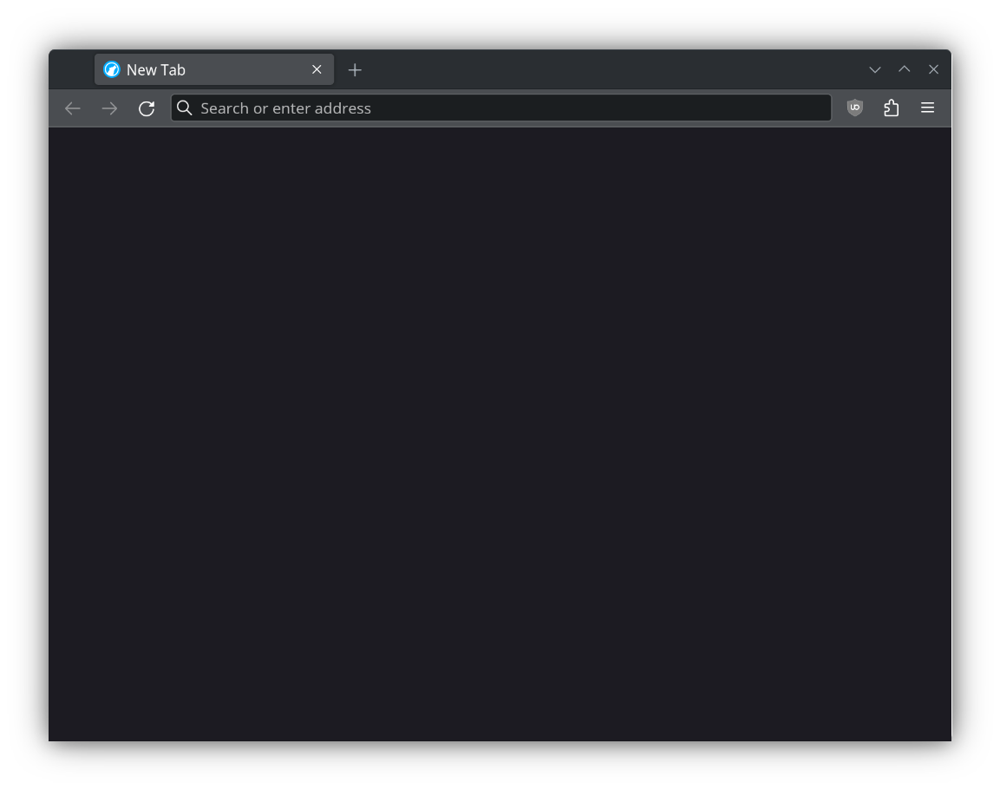
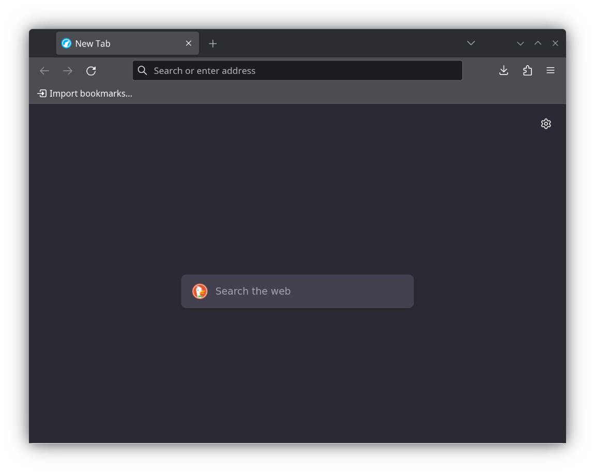

## LibreWolf config by starkle
The people behind the [LibreWolf](https://librewolf.net/docs/features/) project do the hard work of configuring and distributing a version of Firefox that is private, minimal, and free. The config in this repo aims to further realize those goals through aesthetic changes and minor hardening.

Before configuration:  

Note: LibreWolf (like any browser) should only be used if it can update automatically, such as the Flatpak or Microsoft Store packages.

### Usage
To apply this configuration on new installations and profiles, download the `librewolf.overrides.cfg` file and place it where outlined in the [documentation](https://librewolf.net/docs/settings/#where-do-i-find-my-librewolfoverridescfg). The changes can also be applied manually (mostly outside about:config) and are documented in the next section.

### Breakdown
- [Letterboxing](https://librewolf.net/docs/settings/#limit-cross-origin-referers) is enabled. Prevents fingerprinting based on window size.
- [Cross-origin referrers](https://librewolf.net/docs/settings/#limit-cross-origin-referers) are limited. Will cause breakage for better privacy.
- Middle-click paste is disabled to avoid clipboard leaks and confusing behavior.
- Bookmarks toolbar is set to "Never Show". Prevents a potential [browser size fingerprint vector](https://librewolf.net/docs/faq/#does-the-bookmarks-toolbar-impact-rfps-window-size-protection) (also prevented via letterboxing) and keeps the toolbar minimal.
- "Compact" density is enabled. While officially unsupported, it has worked fine for several months and the default options take up too much space*
- Container tabs are disabled. They are [redundant](https://librewolf.net/docs/faq/#why-isnt-first-party-isolate-enabled-by-default), awkward, and clutter the New Tab button.
- The prompt to automatically open a download is enabled. Immediately opening files like archives and torrents is convenient.
- The prompt to select a destination for a download is disabled. The previous prompt is enough hassle.
- Autoscrolling is enabled for snappy navigation.
- Scrollbars are set to "always show".
- The ugly picture-in-picture button is disabled. Can still be accessed in right-click menu.
- New windows and tabs are set to "Blank". The Homepage option is ugly and functionally redundant.
- Tab manager button is disabled. Reduces visual clutter, [especially on KDE](./images/tabman-ugly.png)*
- PDF viewer theme is forced into dark mode. Normally follows system theme which is forced light by RFP*
- PDF viewing zoom is initally 100%. The default "automatic" behavior is inconsistent and annoying*
- Links are allowed to open windows rather than tabs. On Linux, external links won't raise the window unless this is enabled.
- The address bar suggestions for Open tabs, Shortcuts, and Search engines are disabled. These always get in the way.

\* only configurable in about:config.

### Post-config Guide
These settings can't be shipped in a config file, but may still be desirable.
- [Add the search engine](https://support.mozilla.org/en-US/kb/add-or-remove-search-engine-firefox) of your choice.
- Extensions > Right-click uBlock Origin > Pin to Toolbar.
- uBlock Origin > Dashboard > Appearance > Theme (Dark).
- Consider putting uBlock Origin into [Medium or Hard](https://github.com/gorhill/uBlock/wiki/Blocking-mode) mode for enhanced security and privacy.
- uBlock Origin > Filter Lists > Enable lists you deem relevant. I recommend EasyList Cookie to hide intrusive cookie banners.
- Extensions > Manage > Manage Extension Shortcuts > uBlock Origin > Activate toolbar button > Set this to your liking. It will make tweaking broken sites easier using Medium or Hard mode. (My setting: Alt+Q)
- Right-click top bar > Customize Toolbar > Drag to remove pointless flexible space on either side of address bar.
- Install other addons only after consulting the [relevant documentation](https://librewolf.net/docs/addons/).

### Roadmap
- Disable JIT for enhanced security
- Flatpak permission hardening guide
